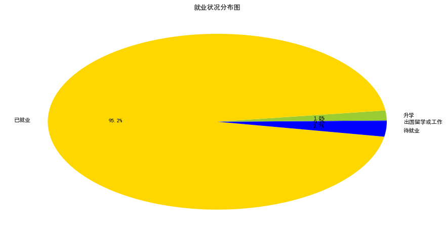

* content
{:toc}

## 2018届通信学院毕业生就业情况分析

今天拿到了去年通信学院的就业情况表，就想着做个关于就业的统计分析。花了3个小时做整个分析的构思、设计和实现，也算是费尽心思了吧！如果本文章有任何设计到侵犯个人隐私的情况，请立即联系本人[18883287680@163.com](18883287680@163.com)，本人承诺马上删除。


* 读取文件


```
import pandas as pd
import matplotlib.pyplot as plt
from pylab import *

file='截止7月20日通信2018届研究生就业信息.xlsx'
sheetname='附件二、各学院就业信息填写'
data=pd.read_excel(file,sheetname,0,1,encoding='utf8')
data=data[['就业单位性质','就业状况','生源地区','实际就业单位','实际所在地']]
data.head()
```

<div>
<style>
    .dataframe thead tr:only-child th {
        text-align: right;
    }

    .dataframe thead th {
        text-align: left;
    }
    
    .dataframe tbody tr th {
        vertical-align: top;
    }
</style>
<table border="1" class="dataframe">
  <thead>
    <tr style="text-align: right;">
      <th></th>
      <th>就业单位性质</th>
      <th>就业状况</th>
      <th>生源地区</th>
      <th>实际就业单位</th>
      <th>实际所在地</th>
    </tr>
  </thead>
  <tbody>
    <tr>
      <th>0</th>
      <td>待就业</td>
      <td>待就业</td>
      <td>四川省眉山市</td>
      <td>NaN</td>
      <td>NaN</td>
    </tr>
    <tr>
      <th>1</th>
      <td>其他企业</td>
      <td>已就业</td>
      <td>河南省驻马店市</td>
      <td>成都三零盛安信息系统有限公司</td>
      <td>四川省成都市</td>
    </tr>
    <tr>
      <th>2</th>
      <td>三资企业</td>
      <td>已就业</td>
      <td>湖北省天门市</td>
      <td>京信通信系统（中国）有限公司</td>
      <td>广东省广州市</td>
    </tr>
    <tr>
      <th>3</th>
      <td>其他企业</td>
      <td>已就业</td>
      <td>江西省萍乡市</td>
      <td>爱立信（中国）通信有限公司</td>
      <td>北京市海淀区</td>
    </tr>
    <tr>
      <th>4</th>
      <td>国有企业</td>
      <td>已就业</td>
      <td>四川省乐山市</td>
      <td>中国移动通信集团四川有限公司天府新区分公司</td>
      <td>四川省成都市</td>
    </tr>
  </tbody>
</table>
</div>


* 设置图格式和大小


```
mpl.rcParams['font.sans-serif'] = ['SimHei']
font_size = 11  # 字体大小
fig_size = (8, 6) # 图表大小
# 更新字体大小
mpl.rcParams['font.size'] = font_size
```

### 就业状况分析


```
res=data.groupby('就业状况').count()
plt.figure(figsize=(15,8))
plt.pie(res['就业单位性质'].tolist(), labels=res.index, autopct='%1.1f%%', colors=['blue', 'yellowgreen', 'gold'])
plt.title(u'就业状况分布图')
plt.show()
```




### 就业所在地分析


```
#删除有空值的行，这里删除升学的那一批人
data_work=data.dropna()
data_work['province']=data_work['实际所在地'].apply(lambda x:x[:3])
data_work.head()
```

<div>
<style>
    .dataframe thead tr:only-child th {
        text-align: right;
    }

    .dataframe thead th {
        text-align: left;
    }
    
    .dataframe tbody tr th {
        vertical-align: top;
    }
</style>
<table border="1" class="dataframe">
  <thead>
    <tr style="text-align: right;">
      <th></th>
      <th>就业单位性质</th>
      <th>就业状况</th>
      <th>生源地区</th>
      <th>实际就业单位</th>
      <th>实际所在地</th>
      <th>province</th>
    </tr>
  </thead>
  <tbody>
    <tr>
      <th>1</th>
      <td>其他企业</td>
      <td>已就业</td>
      <td>河南省驻马店市</td>
      <td>成都三零盛安信息系统有限公司</td>
      <td>四川省成都市</td>
      <td>四川省</td>
    </tr>
    <tr>
      <th>2</th>
      <td>三资企业</td>
      <td>已就业</td>
      <td>湖北省天门市</td>
      <td>京信通信系统（中国）有限公司</td>
      <td>广东省广州市</td>
      <td>广东省</td>
    </tr>
    <tr>
      <th>3</th>
      <td>其他企业</td>
      <td>已就业</td>
      <td>江西省萍乡市</td>
      <td>爱立信（中国）通信有限公司</td>
      <td>北京市海淀区</td>
      <td>北京市</td>
    </tr>
    <tr>
      <th>4</th>
      <td>国有企业</td>
      <td>已就业</td>
      <td>四川省乐山市</td>
      <td>中国移动通信集团四川有限公司天府新区分公司</td>
      <td>四川省成都市</td>
      <td>四川省</td>
    </tr>
    <tr>
      <th>5</th>
      <td>其他企业</td>
      <td>已就业</td>
      <td>重庆市渝中区</td>
      <td>成都中兴软件有限责任公司</td>
      <td>四川省成都市</td>
      <td>四川省</td>
    </tr>
  </tbody>
</table>
</div>


```
import numpy as np
def autolabel(rects):
    for rect in rects:
        height = rect.get_height()
        plt.text(rect.get_x()+rect.get_width()/2.-0.2, 1.03*height, '%s' % float(height),fontsize=15)
res=data_work.groupby('province').count()
plt.figure(figsize=(16,7))
a=plt.bar(np.arange(len(res)),res['就业单位性质'].tolist(),0.4,color='green')
autolabel(a)
plt.xticks(np.arange(len(res)),res.index)
plt.title(u'就业所在地分布图')
plt.show()
```


### 就业单位性质分析


```
res=data_work.groupby('就业单位性质').count()
plt.figure(figsize=(16,7))
a=plt.bar(np.arange(len(res)),res['就业状况'].tolist(),0.4,color='green')
autolabel(a)
plt.xticks(np.arange(len(res)),res.index)
plt.title(u'就业单位性质分析分布图')
plt.show()
```


### 生源地分析


```
#数据中广西有点烦，什么广西桂林,广西玉林市。。。命名不规范,其他还有很多，不想处理了，哈哈
def process_guangxi(arr):
    line=arr['生源地区']
    if '广西' in line:
        line='广西省'+line
    return line[:3]
data_work['origin']=data.apply(process_guangxi,axis=1)
res=data_work.groupby('origin').count()
plt.figure(figsize=(16,7))
a=plt.bar(np.arange(len(res)),res['就业单位性质'].tolist(),0.4,color='green')
autolabel(a)
plt.xticks(np.arange(len(res)),res.index)
plt.title(u'生源地分布图')
plt.show()
```

    D:\tools\anaconda\lib\site-packages\ipykernel_launcher.py:7: SettingWithCopyWarning: 
    A value is trying to be set on a copy of a slice from a DataFrame.
    Try using .loc[row_indexer,col_indexer] = value instead
    
    See the caveats in the documentation: http://pandas.pydata.org/pandas-docs/stable/indexing.html#indexing-view-versus-copy
      import sys


### 选择本地就业还是外地就业分析


```
a=np.sum(data_work['province']==data_work['origin'])
b=len(data_work)-a
plt.figure(figsize=(15,8))
plt.pie([a,b], labels=['本地就业','外地就业'], autopct='%1.1f%%', colors=['blue', 'yellowgreen', 'gold'])
plt.title(u'本地就业、外地就业分布图')
plt.show()
```


### 沿海就业比例分析


```
yanhai_cities=[u'辽宁省',u'河北省',u'天津省',u'山东省',u'江苏省',u'上海省',u'浙江省',u'福建省',u'广东省',u'广西省']
def yanhai(city):
    if city in yanhai_cities:
        return True
    else:
        return False
    
data_work['outside']=data_work['province'].apply(yanhai)
a=np.sum(data_work['outside']==[True for i in range(len(data_work))])
b=len(data_work)-a
plt.figure(figsize=(15,8))
plt.pie([a,b], labels=['沿海就业','内陆就业'], autopct='%1.1f%%', colors=['yellowgreen', 'gold'])
plt.title(u'沿海就业比例分布图')
plt.show()
```
    


